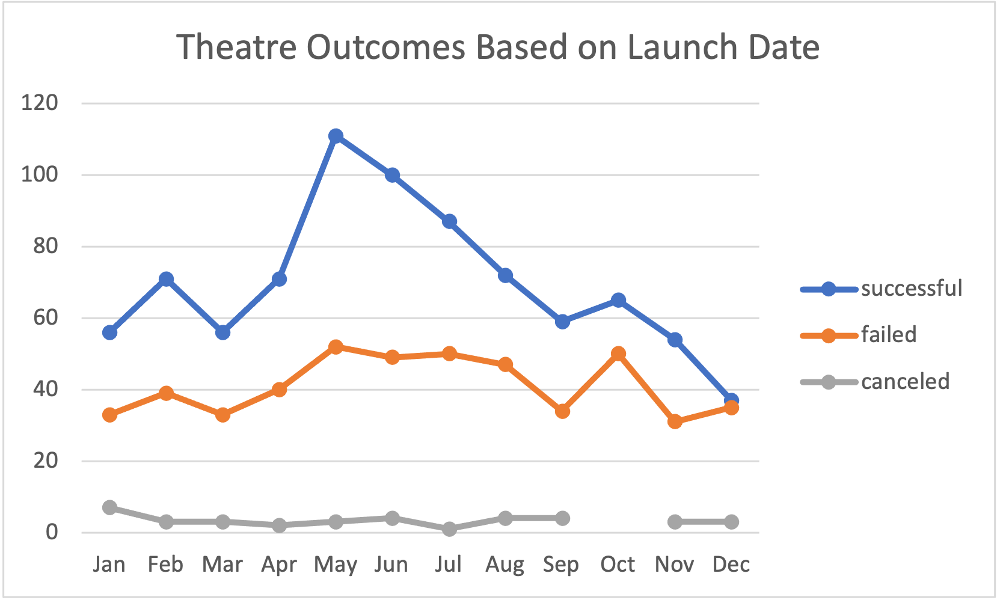

# Kickstarter-Analysis

## Overview of Project
Using kickstarter data, an analysis was run on kickstarter goals, outcomes, and lauch dates within the parent category/subcategory theatre/plays.
### Purpose: 
To support Louise in other plays outside of her play Fever this kickstarter analysis was run to determine how different kickstarter campaigns compared to others in relation to their launch dates and funding goals within the theatre/play category.
## Analysis and Challenges

### Analysis of Outcomes Based on Launch Date
To determine how theatre kickstarters compared based on launch date, I created a pivot table filtered by the "Parent Category" and "Years." The "Parent Category" filter allows filtering to "theatre" and Years can be filtered as needed. The rows are the months the kickstarters launched and columns are the values of outcomes ("successful," "failed," and "cancelled"). A pivot chart was created with Launch Months on the bottom, X-axis, Number of Outcomes 0-120 on the y-axis, and the three outcomes of the kickstarters with a legend on the left of the chart (Figure "Theatre Outcomes Based on Launch Date")

### Analysis of Outcomes Based on Goals
Also, an analysis was run to determine what goal range is most successful for plays. This analysis included a range of goals, as seen below, beginning with "Less than 1000" and ending with "50000 to More." The COUNTIFS function was then used to gather the number of successful, failed, and cancelled plays from each range. This function provided that there were 0 cancelled kickstarters under the "Play" subcategory. After determining the number of plays by outcome, the SUM function was used for the outcomes by each range with Goal range "1000 to 4999" having the greatest number of projects and "45000 to 49999" having the least amount of projects. This SUM was then used to calculate the percentage of outcomes based on their total amount per goal range. These percentage outcomes demonstrated that the most successful kcikstarters were less than $1000 goal. After collecting information for outcomes based on a range of goals, a pivot chart was created, as seen below.

### Challenges and Difficulties Encountered
During analysis, I encountered two main difficulties. First, in determing theatre kickstarter outcomes by their launch date, the 0 canceled kickstarters for October confused me. I had to work back through the kickstarter data, filter "outcomes" by "canceled" and "date created version" by October to make sure the table poopulated correectly. Second, after populating the "Outcomes Based on Goals" chart, I realized my data was not correct. When using the COUNTIFS function, I did not filter by "plays" Subcategory which inflated my data. After determining the cause, I was able to correct the data and refresh the chart for an accurate picture of the outcomes based on goals.
## Results

- **What are two conclusions you can draw about the Outcomes based on Launch Date?**

According to the data of "Theatre Outcomes by Launch date," Theatre kickstarters are most successful May through July and begin to slow down August through March. Additionally, every month there are more successful than failed theatre kickstarters. Theatres kickstarters usually do well throughout the year, but launching May through July will allow a greater possibility of success.

- **What can you conclude about the Outcomes based on Goals?**

Knowing what month theatre kickstarters are successfull does not give you enough information to deterine how to to make your play kickstarter successful. The data in Outcomes based on Goals displays the best goal range to determine the kickstarter's success. A play kickstarter will have a 74% success rate if the goal is less than $1000 and no more than $4999. More than a $20000 goal will decrease chances of having a successful kickstarter for your play.
- **What are some limitations of this dataset?**

Although this data provides great information on what month to start your play kickstarter and how to choose a goal that will be successful, it does not provide detail on the kickstarter's region or include the duration of the kickstarter campaign. If Louise was wanting to do a kickstarter for a Play in Canada, this data may not be complete accurate to that region and would need to be adjusted and filtered. This data also does not give detail on the duration of the kickstarters. It is possible that kickstarters with a longer end goal would be more successful, but this data does not yet provide that insight.
- **What are some other possible tables and/or graphs that we could create?**

To provide greater insight that is currently missing, tables on duration of kickstarters for plays along with a chart would be helpful. Additionally, adding a Country filter to each chart could help provided more information on how the data changes in different regions.
